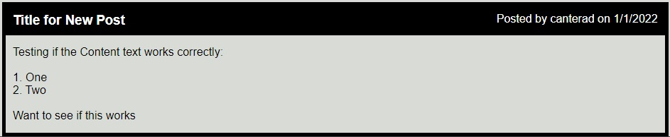
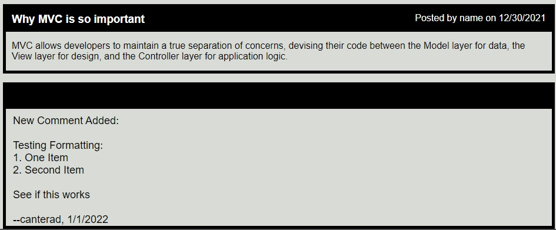

# Tech Blog

Tech Blog for UNH Boot Camp # 14 Model-View-Controller (MVC). 
This repository was created for the Homework Assignment dealing with (MVC) Model-View-Controller.  

Developer: Duane Cantera 
Date: Jan. 4, 2022 
Assignment: #14 - MVC - Tech Blog  

This project consisted of building a CMS-style blog site similar to Wordpress site where developers
can publish their blog posts and comment on other developer's posts as well.  This application 
follows the MVC paradigm in its architectural structure, using Handlebars.js as the templating
language, Sequelize as the ORM, and the express-session npm package for authentication. 
  

### maxAge Cookie Setting:
The maxAge cookie setting is set to 30,000 for five minutes.  If you are login to the site and you
refresh the page after 5 minutes you will see that you will be logged out.
  

### Database Seeded Data:
If you seed the database two users are added and they have the following credentials: 
User1: Username: name, Password: password 
User2: Username: canterad, Password: password
  

### The Following HTML Routes Are Called For Displaying Web Pages:
"Home Page" - HTML GET - Get all Posted Blogs" - "/" 
"Dashboard" - HTML GET -Get Blogs for current user" - "/dashboard" - Code uses session variable "user_id" to get blogs for current user. 
"Login - SignUp" - HTML GET - Display Login Page - "/login" 
"Logout" - HTML GET - Perform logout operation - "/logout" 
"New Post" - HTML GET - Display New Post Page - "/blog/0" - Pass in zero blog id value for new post. 
"Edit Delete Post" - HTML GET - Display Edit Post Page - "/blog/id" - Pass in blog id value of current blog. 
"Add New Comment Page" - HTML GET - Display New Comment Page - "/comment/:id/:blog_id" - Pass in comment id = 0 and blog id. 
"Display Comment Page" - HTML GET - Display Current Comment Page - "/comment/:id/:blog_id" - Pass in comment id and blog id = 0.   

### The Following HTML Routes Are Called For Performing Operations:
"Create A New User" - HTML POST - "/api/users/" 
"Test If User Can Log In" - HTML POST - "/api/users/login" 
"Create A Blog Post" - HTML POST - "/api/blogs/" 
"Update A Blog Post" - HTML PUT - "/api/blogs/id" 
"Delete A Blog Post" - HTML DELETE - "/api/blogs/id" 
"Adding A Comment" - HTML POST - "/api/comments/"
  

### Session Variables Defined:
user_id - This is used to get all of the blogs for the current user on the Dashboard page.  
logged_in - This is used to toggle the login and logout links. Used in withAuth function to test logged in status. user_name - This is used save the current user name so the user name will be added to comments. 
   

### Timing Problems Found When Login, Logout And Deleting A Blog Post Operation Performed:
I found that when I performed the log in and log out operation the main page got refreshed before the operation completed, so the correct log in status was not displayed correctly.  I also found when I performed the delete blog operation the Dashboard page got refreshed before the operation completed, so the blog that I just deleted was still being displayed.
  
SOLUTION: I was able to solve this problem by using the setTimeout command for one second before I called the document.location.replace command to display the new page.  
  

### Display Format Problems With Using Textarea Element To Enter Text And Then Displaying Text In A Paragraph Element:
This occurs when you have added a new blog post: 

  
This occurs when you have added a new comment to a post: 

 
SOLUTION: I had to use the JavaScript command "replaceAll" and replace all '\n' characters with the paragraph "< br >" characters because we are going from text in the text area element to text in a paragraph element.  I also had to use triple brackets {{{ }}} so Handlebars does not HTML-escape the value.
 
{{{blog.content}}}

 

### Passing Data To The Client:
I found that when I needed to perform operations on the Client Side I needed data that was not displayed in 
the document, such as the user id, blog id and username.  I was able to do this by using hidden fields
in some of my views:

`<!-- Save the blog id, user id values and username so have them on the client side. -->` 
`<input type="hidden" id="blogid" value="{{blogItem.id}}">` 
`<input type="hidden" id="userid" value="{{blogItem.user.id}}">`     
`<input type="hidden" id="username" value="{{UsernameItem}}">` 

I was able to get these values in my JavaScript code and use them when I needed to create a blog item 
that contained a user id value or when I needed these id values to perform an update or delete operation.
  

### Technologies Used:
Express.js, Node.js, Sequelize, dotenv, mysql2, express-handlebars, bcrypt, express-session and connect-session_sequelize.
  

### LINKS:

Git Hub Link To Code For Project:  
https://github.com/canterad/Tech_Blog.git
  
Links to Heroku site: 

